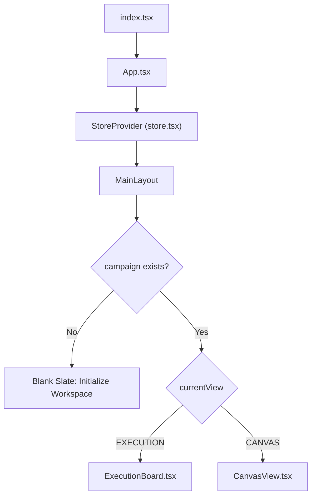
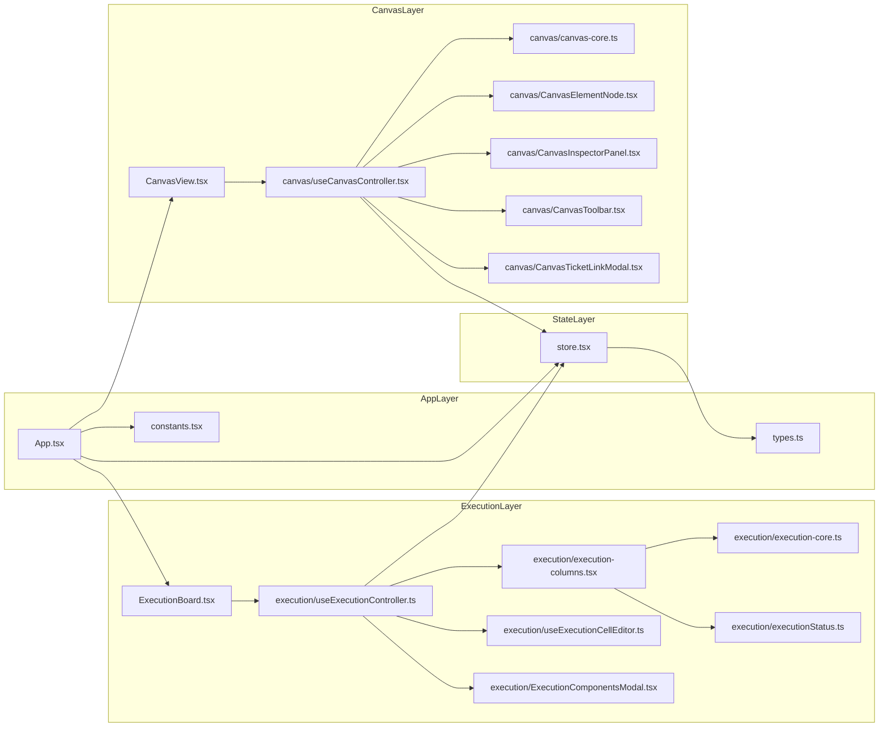
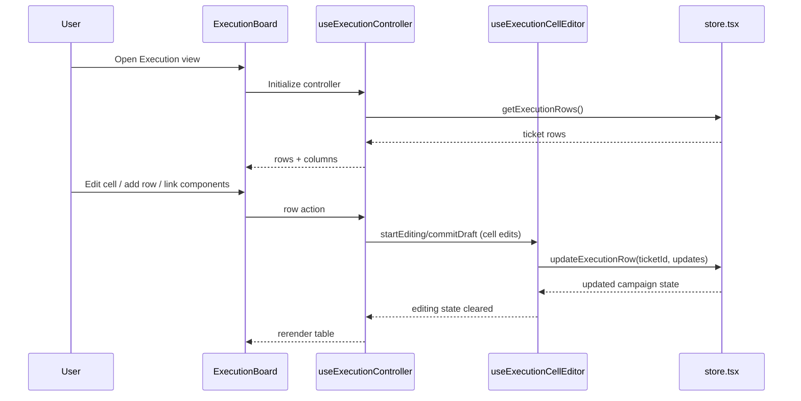
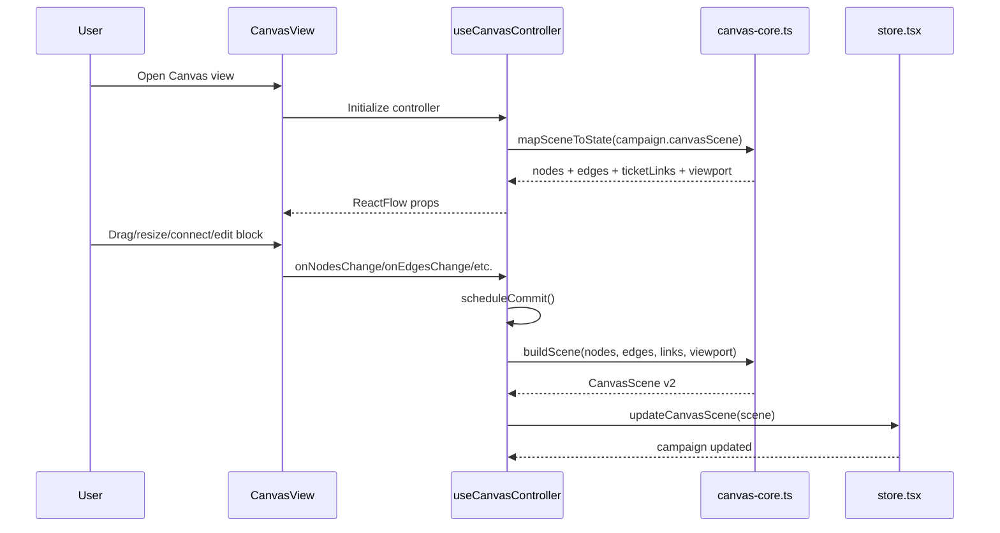
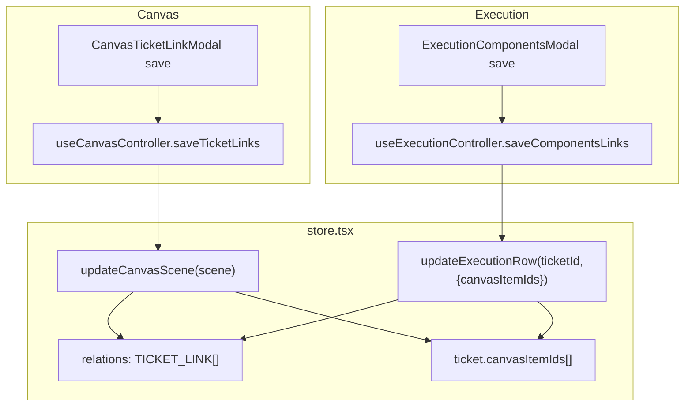
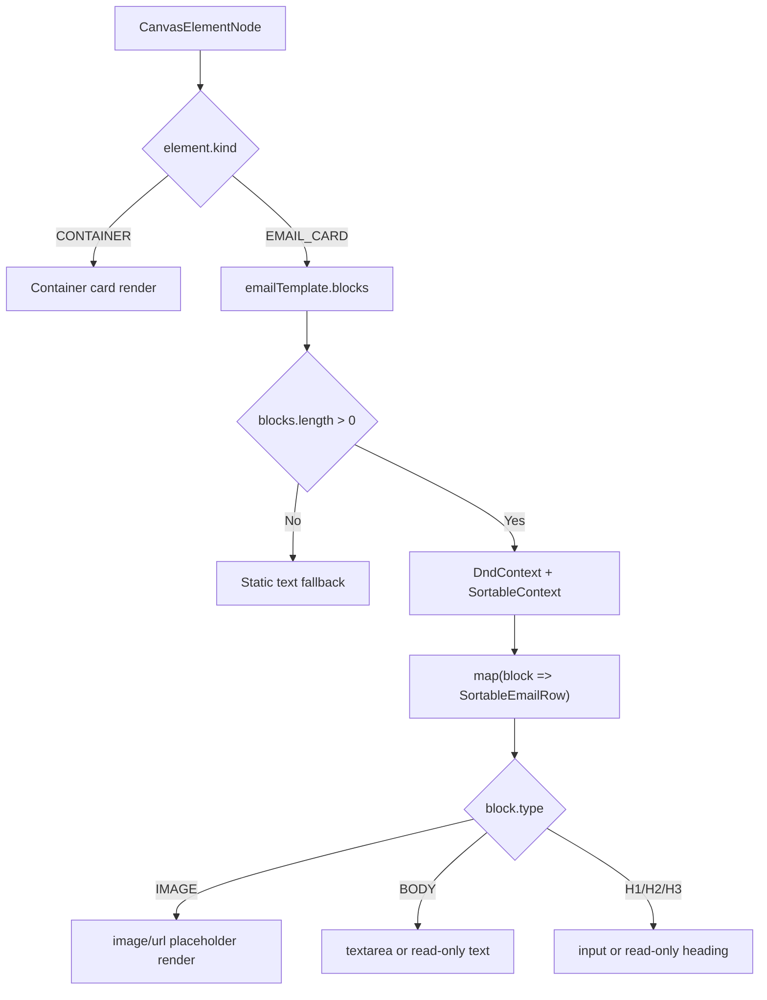
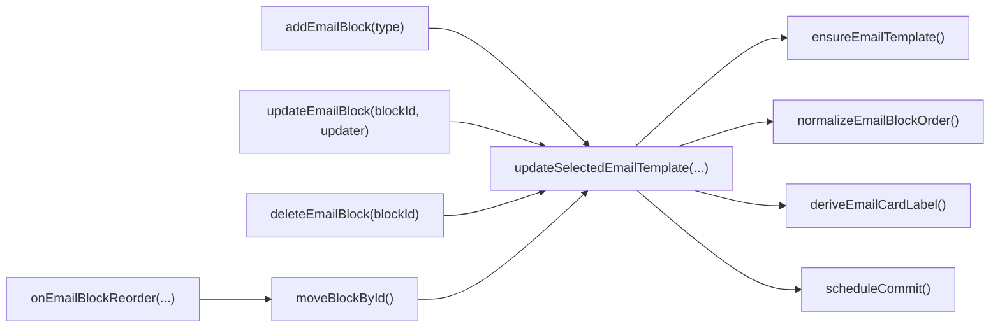
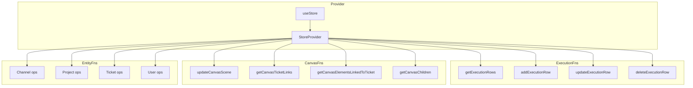
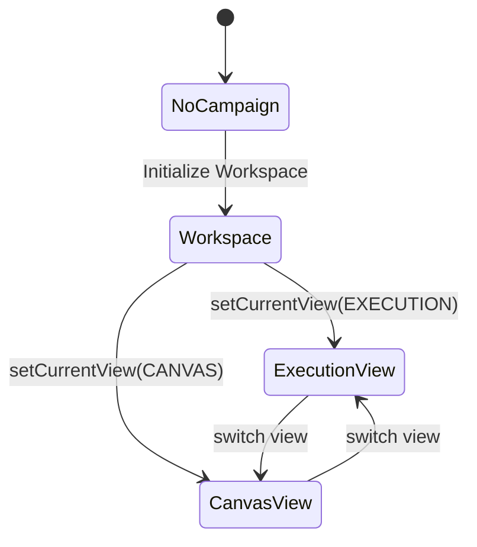
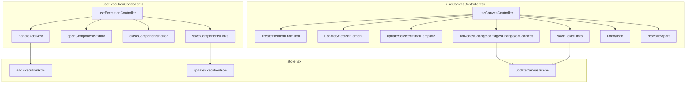

# GTM OS - Flowchart Diagram Pack

This is a diagram-first map of the codebase using flowcharts, sequence diagrams, and state diagrams.

## Rendered Visual Assets (PNG)

- `C:\Users\fredm\.cursor\projects\c-Users-fredm-cursor-but-gtm-2\assets\gtm-system-architecture.png`
- `C:\Users\fredm\.cursor\projects\c-Users-fredm-cursor-but-gtm-2\assets\gtm-runtime-sequence.png`
- `C:\Users\fredm\.cursor\projects\c-Users-fredm-cursor-but-gtm-2\assets\gtm-bridge-sync-flow.png`

Component-level index: `diagrams/README.md`

## 1) System Flow (Top Level)

## 2) Module Dependency Flow

## 3) Execution Runtime Sequence

## 4) Canvas Runtime Sequence

## 5) Bridge Sync Flow (Canvas Links <-> Ticket Links)

## 6) Canvas Element Render Flow

## 7) Email Block Lifecycle Flow

## 8) Store Domain Function Flow

## 9) App View State Diagram

## 10) Function Call Graph (Controller-Level)

## 11) Optional Full Function Index (Reference Table)

- The full named function list is available from source inspection and can be exported into CSV/JSON if you want this as a machine-readable artifact.
